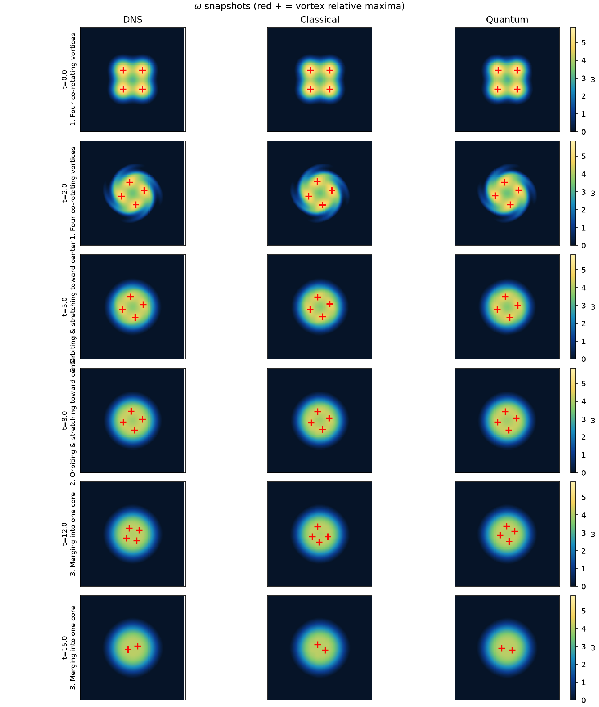

# Quantum Physics Informed Neural PDE Solvers

Variational quantum circuits to outperform physics-informed neural networks for solving PDEs (as weight generators and as field maps) against matched classical baselines. The goal is to advance (and honestly measure) the capabilities of quantum circuits in scientific machine learning.

## Incompressible 2D Navier–Stokes

$$
\begin{aligned}
\partial_t u + u\,\partial_x u + v\,\partial_y u &= -\partial_x p + \nu\,(\partial_{xx} u + \partial_{yy} u), \\
\partial_t v + u\,\partial_x v + v\,\partial_y v &= -\partial_y p + \nu\,(\partial_{xx} v + \partial_{yy} v), \\
\partial_x u + \partial_y v &= 0.
\end{aligned}
$$

*Unstable Taylor–Green Vortex: DNS | classical | quantum. One lobe is amplified so the exact-solution balance breaks and nonlinear advection turns on. Classical and quantum PINNs are trained from scratch on this DNS.*

*Vortex merger $\omega$ snapshots (red + = vortex relative maxima): DNS | classical teacher | deployable student across gate times.*

## Where it stands

| Checkpoint | FD-curl $\omega$ relative $L^{2}$ | Notes |
|------------|-----------------------------------|-------|
| Classical HarmMLP 96–96 | **1.29%** | Product teacher vs spectral DNS |
| Deployable HarmMLP 48–48 | **1.78%** | ~2.5× faster inference; circuit unused |
| Fair quantum vs classical generators | no robust Q win | Classical mean $\omega$ better by ~0.10 pp (4/6 seeds) |

Hypernetwork VQCs (TGV / Kolmogorov) and the input-conditioned Burgers VQC lose or freeze under matched protocols. Full write-up: [`blog/blog.md`](blog/blog.md).
