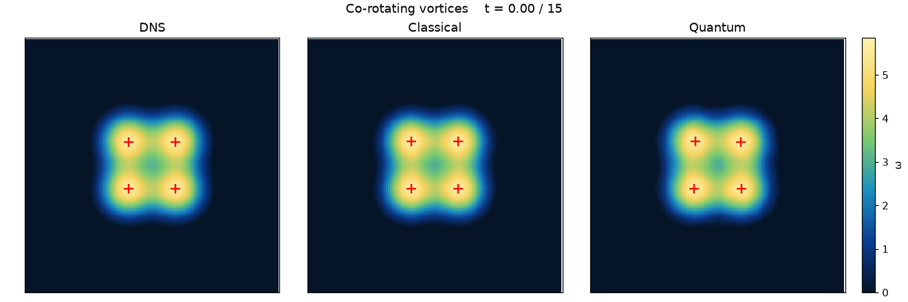

# Evaluating Variational Quantum Circuits in Physics-Informed Neural Networks for 2D Navier–Stokes

[](https://github.com/JanosMozer/qt-pinn)

A systematic evaluation of variational quantum circuits (VQCs) inside physics-informed neural networks (PINNs) for 2D incompressible Navier–Stokes. The work spans ν-conditioned hypernetworks, input-conditioned VQC field maps, and quantum weight generators for vortex merger. Matched classical baselines, degeneracy guards, and fixed DNS holdouts show no robust quantum advantage on these tasks. The project product is a classical HarmMLP PINN that reconstructs four-vortex merger against spectral DNS to **1.29%** FD-curl ω relative L2, with a smaller distilled deployable net at **1.78%** ω and ~2.5× inference throughput.

Companion metrics: [MODEL_CARD.md](MODEL_CARD.md). Versioned checkpoints and media: [checkpoint/](checkpoint/).

## 1. Introduction

### 1.1 Quantum Circuits for Scientific Machine Learning
Physics-informed neural networks enforce PDE residuals, boundary conditions, and data constraints through automatic differentiation. Pairing PINNs with variational quantum circuits is a recurring “quantum for science” proposal: either the circuit generates network weights from a physical parameter (hypernetwork), or it evaluates the field map \(f(x,y,t)\) directly. In simulation, both paths are expensive. PennyLane `default.qubit` runs on CPU; PINN training requires second-order autodiff through the circuit; wall-clock cost is routinely 100–800× a matched classical MLP at equal collocation size.

The scientific claim is not that a circuit can be wired into a loss. The claim is that, under fair capacity and protocol matching, the quantum model improves a primary metric without collapsing to a trivial solution.

### 1.2 Evaluation Failure Modes
Early quantum-PINN reports are easy to invalidate:
1. **Trivial solutions.** Soft initial-condition penalties admit \(u=v=0\) on Burgers and TGV when the PDE residual of the zero field is small.
2. **Unequal architectures.** Comparing a tiny deployed MLP labeled “quantum” to a much larger classical teacher confuses size with quantum compute.
3. **Dead or constant circuits.** Fixed circuit inputs, zeroed projection weights, or unused generators look like quantum training while computing classically.
4. **Proxy metrics.** PDE residual alone, or velocity MSE without vorticity structure, can look strong while the flow topology is wrong.

This project treats those failure modes as first-class engineering constraints: matched parameters (or classical ≥ quantum), fixed holdouts, soft vs hard IC made explicit, and degeneracy diagnostics (`collapse_ratio`, `correction_rms`, circuit ablation).

### 1.3 Project Goal
The applied goal is a reproducible 2D Navier–Stokes PINN for **vortex merger** against spectral DNS, with FD-curl vorticity error ≤ 2%. The research goal is to test whether VQC hypernetworks or generators beat matched classical models on TGV, Kolmogorov forcing, Burgers, and merger. Evidence cutoff: 2026-08-26. All quantum results are simulator-only; no hardware.

## 2. Fairness Protocol and Metrics

### 2.1 Matching Rules
1. **Capacity.** Trainable parameter counts matched, or classical ≥ quantum.
2. **Protocol.** Same domain, viscosity ν, collocation / IC sampling, and (when soft IC) penalty weights λ.
3. **Features.** Where the VQC sees angle encodings, the classical control receives the corresponding sin/cos features.
4. **Holdouts.** Fixed grids or held-out ν values; not a fresh i.i.d. draw of the training range labeled as generalization.
5. **Wall time.** Report simulator wall clock, not only optimizer step count.

### 2.2 Primary Metrics
| Problem | Primary metric | Secondary |
|---------|----------------|-----------|
| Taylor–Green (exact) | Velocity / gauge-aware pressure rel-L2; in-range vs extrapolated ν | Wall time |
| Kolmogorov (forced NS) | Holdout PDE residual RMS | Extrapolation in ν |
| Burgers VQC | Holdout PDE RMS under **hard IC** | `collapse_ratio`, `correction_rms` |
| Vortex merger | FD-curl ω rel-L2 max at \(t\in\{0,2,5,8,12,15\}\), FP32 | Velocity rel-L2; inference pts/s |

### 2.3 Degeneracy Guards
| Diagnostic | Meaning | Fail if |
|------------|---------|---------|
| `collapse_ratio` = field_rms(\(t=1\)) / IC_rms | Near-zero field | < 0.1 |
| `correction_rms` under hard IC \(u=u_{IC}+t\,N\) | Learned time evolution | ≪ 0.01 × IC_rms (freeze) |
| Soft IC `bc_loss ≈ 0.5` | Matches \(u=v=0\) predictor | Plateau at ~0.5 with falling PDE |
| Circuit ablation | Randomize `q_weights` / zero feats | ω does not degrade → circuit unused |

**Success criteria.** Quantum win: primary metric ≤ 90% of classical *and* non-degenerate. Parity: within ~10%. Otherwise classical wins / null. Soft-IC PDE RMS alone is never promoted.

## 3. System Architecture

### 3.1 Classical Target PINNs
Deployed solvers are classical MLPs evaluated at query time \((x,y,t)\mapsto(u,v,p)\):
- **DirectNSMLP** — Fourier / polynomial time features for TGV demos.
- **HarmMLP / TargetPINNNS** — harmonic Fourier features in \(x,y\) with time channels, used for merger (product: 96–96, \(k\le 6\); distilled student: 48–48, \(k\le 3\)).

Training combines DNS collocation (merger), PDE residual, and optional hard IC of the form \(u = u_{IC} + t\,N\).

### 3.2 Quantum Paths Tested
```
Path A — ν-hypernetwork (TGV / Kolmogorov)
  ν ──► VQC / classical encoder ──► MLP weights ──► TargetPINN(x,y,t)

Path B — Input-conditioned VQC (Burgers)
  (x,y,t) ──► angle encode ──► re-uploading VQC ──► ⟨Z⟩ ──► linear ──► (u,v)

Path C — Conditioned weight generator (merger)
  features ──► ConditionedQuantumGeneratorV2 ──► deployed HarmMLP weights
                 (classical twin: ConditionedClassicalGeneratorV2)
```

*Figure 1: Three quantum integration patterns. Only Path B evaluates the circuit on field coordinates. Paths A and C use the circuit (when live) as a weight generator; inference remains a classical MLP.*

Architectural constraint: a hypernetwork that never sees \((x,y,t)\) cannot claim circuit-in-the-loop PDE evaluation. Path C can still be a fair test of whether a quantum generator beats a matched classical generator at **equal deployed latency**.

### 3.3 DNS Reference (Merger)
Periodic box \([0,2\pi]^2\), ν = 0.005, four co-rotating Gaussian vortices → single core by \(t\sim 15\). Reference: 256² spectral DNS (`checkpoint/v3/dns/`, mirrored under `v4/dns/`). Gate times \(t\in\{0,2,5,8,12,15\}\). Metric: finite-difference curl \(\omega=\partial_x v-\partial_y u\), FP32 only, max relative L2 ≤ 2%.



*Figure 2: Vortex merger — DNS | classical HarmMLP | quantum-trained deployable net. Product gate: FD-curl ω ≤ 2%. No tracer particles.*

## 4. Debugging Invalid Early Results

### 4.1 Pressure Sign Inconsistency (TGV)
Symptom: `bc_loss ≈ 0.56`, low PDE loss, ~100% rel-L2 → collapse to \(u=v=p=0\). Cause: exact pressure sign disagreed with the velocity convention, so the coded residual did not match the analytic solution. Fix:

\[
p = +\tfrac14(\cos 2x + \cos 2y)\,e^{-4\nu t}.
\]

Lesson: a low PDE residual can mean “learned the zero field,” not “solved the PDE.”

### 4.2 Dead Time Channel
Adding Fourier “time features” produced byte-identical runs because the \(t\) row of the feature matrix was identically zero. Fix: explicit \(t/T\) (and optionally \(t^2/T^2\)). Easy regimes (\(\nu=0.01\), \(T=1\)) further hide time dependence because amplitude \(\approx e^{-0.02}\approx 0.98\).

### 4.3 Constant-Input Quantum Generator
A generator whose circuit input is a fixed vector emits one weight vector forever — classical lookup of static weights, not functional quantum computation. Such runs invalidate Tier-0 advantage claims.

### 4.4 Soft IC Collapse on Burgers
\(u=v=0\) solves 2D Burgers with zero residual. Soft IC with moderate \(\lambda_{bc}\) creates a basin of “be zero.” Soft-IC scouts showed quantum “winning” PDE RMS (~0.018 vs ~0.21) while both plateaus sat at `bc ≈ 0.5`; quantum collapsed harder. Fix: hard IC

\[
u = u_{IC}(x,y) + t\,N_u,\quad
u_{IC}=\sin(\pi x)\cos(\pi y),\quad
v_{IC}=-\cos(\pi x)\sin(\pi y).
\]

### 4.5 Encoding / Frequency Bugs
Double-\(\pi\) frequency scaling and even time frequencies that alias \(t=0\) with \(t=1\) on \([0,1]\) produce erratic VQC errors. Fix: dimensionless ladders; spatial even frequencies for the IC fundamental; **odd** time frequencies.

## 5. Experiment Ladder: Hypernetworks and Burgers VQC

### 5.1 Tier A — Classical Sanity Gate
Direct classical PINNs establish that the PDE is learnable after physics fixes: TGV ~2.7% mean velocity rel-L2 at \(t=1\); harder regime \(\nu=0.1\), \(T=5\) ~4% at \(t=5\); Kolmogorov direct PDE RMS **0.00246**. Quantum models must beat a working classical baseline, not a collapsed field.

### 5.2 Tier B — TGV Parametric Hypernetworks (\(\nu\mapsto\) weights)
| Split | Classical `ns_par_c_s0` | Quantum `ns_par_q_s0` | Q/C |
|-------|-------------------------|------------------------|-----|
| in-range | **1.33%** | 1.72% | 1.29 |
| extrap-lo | **2.09%** | 49.0% | **23.4** |
| Wall time | 1182 s | 2146 s | 1.82× |

A redesigned `expect` + log-ν encoding removed quantum extrapolation chaos but did not produce a win (in-range Q/C ≈ 1.11; best classical remains v1). **Verdict: classical wins.**

### 5.3 Tier C — Kolmogorov Forced NS
| Split | Classical | Quantum | Q/C |
|-------|-----------|---------|-----|
| in-range PDE RMS | **0.00288** | 0.00534 | 1.85 |
| Combined extrap | — | — | **1.50** |
| Wall time | 1145 s | 2119 s | 1.85× |

Same null on a harder PDE with sustained nonlinearity. Hypernetwork VQC line closed.

### 5.4 Input-Conditioned Burgers VQC
Matched capacity (~92 quantum vs ~98 classical parameters):

```
(x,y,t) → angles → re-uploading VQC → ⟨Z_i⟩ → linear → (u,v)
(x,y,t) → same angles → sin/cos → tanh MLP → (u,v)
```

Hard-IC scout (400 steps, 512 collocation points):

| Metric | Classical | Quantum | Frozen IC (\(N=0\)) |
|--------|-----------|---------|---------------------|
| Holdout PDE RMS | **0.799** | 1.631 | **1.563** |
| `collapse_ratio` | 0.67 | 0.996 | 1.0 |
| `correction_rms` | 0.57 | **0.024** | 0 |
| Wall time | 4 s | 732 s | — |

Classical learns viscous/advective evolution (`corr_rms` rises). Quantum freezes near the IC residual floor from ~step 125. Full preset (~60 h) was not run: failure is expressivity / basin geometry, not undertraining. Simulator cost: ~7 s/step at 512 points for quantum vs milliseconds for classical on GPU.

### 5.5 Structural Reading
1. Mapping \(\nu\to\sim 1500\) weights is a classical-friendly encoder problem; the circuit never sees the field.
2. TGV families are nearly linear diffusion (advection and pressure cancel) — a weak stress test for entanglement.
3. A linear head on \(\langle Z\rangle\) plus a small re-uploading circuit behaves like low-order trigonometric features; Burgers advection needs a second harmonic that the matched MLP can form and the VQC did not.
4. Matched parameter count does not imply matched useful function class under quantum constraints.

## 6. Product Solver: 2D Vortex Merger

Earlier sections concern failed quantum architectures. This section is the shipped solver: reconstruct four same-sign vortex merger against spectral DNS.

### 6.1 What Reached the ω Gate
| Approach | Outcome |
|----------|---------|
| Pointwise \((u,v)\)+curl, streamfunction, uvpw, wide RFF | Did not hit 2% ω |
| HarmMLP 96–96, \(k\le 6\) | **1.29%** classical teacher |
| Distill HarmMLP 48–48, \(k\le 3\) | **1.75%** classical / **1.78%** inject |
| End-to-end QNN vs matched classical generator | No robust advantage |
| Multi-ν family generators | Both arms ~33%+ ω |
| Orbit-gated Rel + peak co-rotation | Partial; not promoted |

Harmonic Fourier features plus an FP32 curl gate on fixed DNS times were decisive. Distillation into a smaller HarmMLP preserves the ≤2% band at higher throughput.

### 6.2 Product Checkpoints
| | Classical teacher | Deployable inject (“quantum” product) |
|--|-------------------|----------------------------------------|
| Checkpoint | `checkpoint/v4/classical/` | `checkpoint/v4/quantum/` |
| Deployed net | HarmMLP 96–96, \(k\le 6\) | HarmMLP 48–48, \(k\le 3\) |
| Params | 13 347 | 3 795 |
| ω rel-L2 max | **1.29%** | **1.78%** |
| Velocity rel-L2 max | 3.75% | 2.95% |
| Inference (256²) | ~326 Mpts/s | ~829 Mpts/s (**~2.5×**) |
| Circuit at train / infer | n/a | **Unused** (proj weight zeroed; student copied into bias) |

Control C: classical distill of the same h48k3 hits **1.75%** ω. The “2.5× faster quantum” product story is architecture size, not quantum computation. Full per-time tables: [MODEL_CARD.md](MODEL_CARD.md), `checkpoint/v4/bench.json`.


*Figure 3: Merger snapshots across gate times for DNS, classical teacher, and deployable student.*

### 6.3 Fair End-to-End Advantage (Experiment A)
Protocol: train `ConditionedQuantumGeneratorV2` end-to-end (circuit + projection receive gradients) against `ConditionedClassicalGeneratorV2` at matched qubit / bottleneck width. Both emit weights for the **same** HarmMLP 48–48, \(k\le 3\). Circuit ablation must degrade ω on quantum runs.

Primary matchup (q=8, L=4, bn=64; seeds 0–5):

| | Quantum generator | Classical generator |
|--|-------------------|---------------------|
| Mean ω ± pstdev | 2.325% ± 0.38% | **2.220% ± 0.24%** |
| Seed wins | 2/6 | **4/6** |
| Best seed | 1.895% | 1.987% (long classical best **1.823%**) |

Δ mean **+0.10 pp against quantum**. Bottleneck-16, V1-probs, and long+curl×2 sweeps agree or favor classical. **Verdict: no robust quantum advantage** at matched deployed latency. Scoreboard: `checkpoint/v4/archive/advantage_scoreboard.md`.

### 6.4 Multi-ν Family (Experiment B)
DNS family ν∈{0.002…0.02}, hold out ν=0.008. Both quantum and classical generators plateau ~33–50% train ω_mean — not solvers. No advantage claim.

### 6.5 Orbit / Swirl Fidelity
Pointwise Rel-L2 can pass while vorticity maxima **freeze** (DNS peaks continue to co-rotate). Adding orbital Fourier features \(\sin/\cos(\Omega t)\) with \(\Omega\approx -1.22\) unfroze early motion. Full-horizon swirl ≤5% with Rel≤2% was not achieved in one promoted checkpoint (best compromise ~1.9% Rel / ~7% swirl). Product weights remain the pre-orbit inject pair. Details: `checkpoint/v4/archive/orbit_fidelity/`.

## 7. Taylor–Green Media and Unstable Perturbation

Stable 2D TGV is a weak physics stress test: \((u\cdot\nabla)u\) is absorbed into pressure, so the pattern only decays. It remains useful for visual fidelity and for demonstrating solver agreement with an exact solution.


*Figure 4: Dense Taylor–Green \|ω\| (wavenumber k=2) with merger-style deep-blue→yellow colormap.*


*Figure 5: Exact | classical | quantum-trained TGV (k=1, v2 polish weights; velocity rel-L2 ≈ 0.61% / 0.62%).*

Amplifying the bottom-left vortex breaks exact balance and turns nonlinear advection back on. Strong unstable settings: boost ×5.5, ν=0.03, \(T=12\) (~12.1 s @ 10 fps).


*Figure 6: Unstable TGV — DNS | classical | quantum. Red + marks the boosted lobe. Classical/quantum trained from scratch on this DNS (soft IC).*

## 8. Empirical Findings

1. **Classical PINNs solve the merger gate.** HarmMLP 96–96 reaches **1.29%** FD-curl ω vs DNS; distilled 48–48 stays inside 2% at ~2.5× inference throughput.
2. **ν-hypernetwork VQCs lose.** On TGV and Kolmogorov, matched classical generators are more accurate and ~1.8–2× faster to train in wall clock.
3. **Soft IC produces fake quantum wins.** Hard IC + degeneracy guards reverse the Burgers soft-IC ranking; quantum freezes near the IC.
4. **Fair e2e quantum generators do not beat matched classical generators** on single-ν merger (Q wins 2/6 seeds; mean favors classical by ~0.10 pp).
5. **Inject ≠ circuit.** Zeroing the generator projection and copying a distilled student yields a “quantum” checkpoint whose circuit never contributes.
6. **Pointwise ω ≠ swirl fidelity.** Orbit features help; a Rel≤2% and swirl≤5% product checkpoint was not shipped.
7. **Simulator cost dominates.** Input-conditioned VQC PINNs are minutes-per-epoch territory at scout scale; classical MLP baselines are milliseconds per step on GPU.

## 9. Conclusion

The contribution is a careful negative result on variational quantum circuits inside PINNs for 2D Navier–Stokes, paired with a positive classical PDE product. Under matched capacity, fixed holdouts, and degeneracy checks, VQC hypernetworks and input-conditioned circuits do not beat classical baselines on TGV, Kolmogorov, or Burgers. End-to-end quantum weight generators for vortex merger likewise show no robust advantage at equal deployed latency.

What does work is a harmonic-feature PINN against spectral DNS: **1.29%** ω on the classical teacher, **1.78%** on a smaller deployable net with ~2.5× query throughput. That speedup is model size, not quantum compute. The practical lesson for quantum scientific ML is methodological: without hard IC, ablation tests, and architecture-matched controls, it is easy to ship a story the circuit never earned.

## References

[1] M. Raissi, P. Perdikaris, and G. E. Karniadakis (2019). *Physics-informed neural networks: A deep learning framework for solving forward and inverse problems involving nonlinear partial differential equations*. Journal of Computational Physics, 378, 686–707.

[2] G. E. Karniadakis, I. G. Kevrekidis, L. Lu, P. Perdikaris, S. Wang, and L. Yang (2021). *Physics-informed machine learning*. Nature Reviews Physics, 3, 422–440.

[3] V. Bergholm et al. (2018). *PennyLane: Automatic differentiation of hybrid quantum-classical computations*. arXiv:1811.04968. [https://arxiv.org/abs/1811.04968](https://arxiv.org/abs/1811.04968)

[4] M. Schuld, A. Bocharov, K. M. Svore, and N. Wiebe (2020). *Circuit-centric quantum classifiers*. Physical Review A, 101, 032308.

[5] A. Pérez-Salinas, A. Cervera-Lierta, E. Gil-Fuster, and J. I. Latorre (2020). *Data re-uploading for a universal quantum classifier*. Quantum, 4, 226.

[6] G. I. Taylor and A. E. Green (1937). *Mechanism of the production of small eddies from large ones*. Proceedings of the Royal Society A, 158, 499–521.

[7] Checkpoints and metrics for this work: [MODEL_CARD.md](MODEL_CARD.md), `checkpoint/v4/bench.json`, `checkpoint/v4/archive/advantage_scoreboard.md`.
