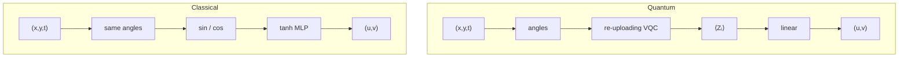
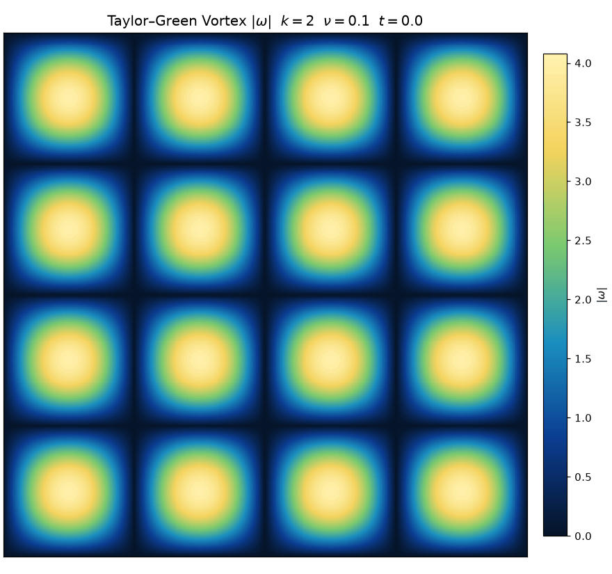
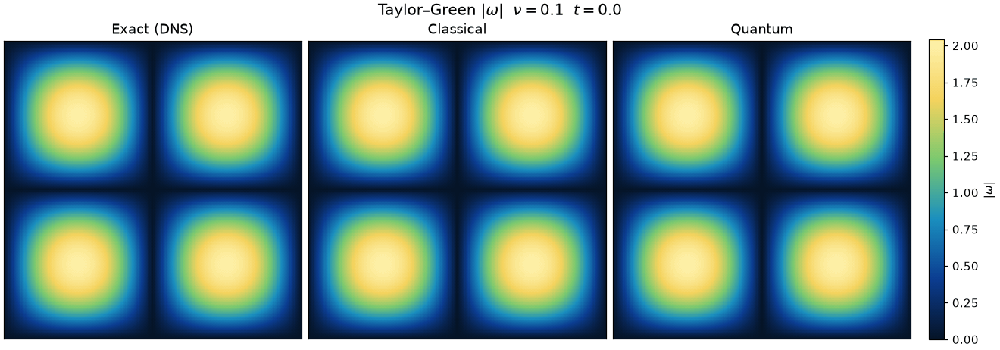
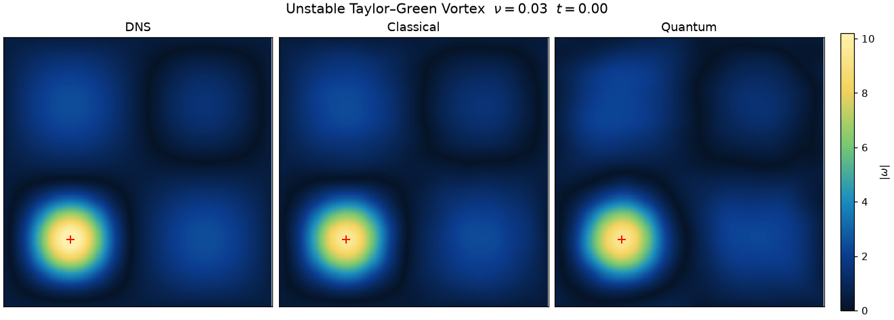

# Quantum Physics Informed Neural Solvers for PDEs

date: August 27, 2026
slug: quantum-neural-solvers
status: Published
tags: machine learning, physics
summary: Can tiny quantum neural networks outperform massive deep learning models? We don’t know (yet), but we collected everything you need to know about the topic, and through a set of experiments we explore the most promising application: PINNs.
type: Post

# Variational Quantum Circuits in Physics-Informed Neural Networks for 2D Navier–Stokes

Github: [*https://github.com/JanosMozer/quantum-neural-pde-solver*](https://github.com/JanosMozer/quantum-neural-pde-solver)

We evaluated three ways to put a variational quantum circuit into a physics-informed neural network against parameter-matched classical controls. We found no robust quantum advantage. The working solver is a classical harmonic feature model. Auditing our own pipeline showed that our shipped quantum checkpoint had zeroed its circuit, while an entangled Quantum-Train generator (the quantum circuit predicts the weights of a classical network which is used at inference) on Burgers was matched by a standard classical random projection.

More technically, we did a systematic evaluation of Variational Quantum Circuits (VQCs) inside Physics-Informed Neural Networks (PINNs) for 2D incompressible Navier–Stokes. The work spans $\nu$-conditioned hypernetworks, input-conditioned VQC field maps, and quantum weight generators for vortex merger. Matched classical baselines, degeneracy guards, and fixed DNS holdouts show no robust quantum advantage on these tasks. The project’s product is a classical HarmMLP PINN that reconstructs four-vortex merger against spectral DNS to **1.29%** FD-curl $\omega$ relative $L^2$, with a smaller distilled deployable net at **1.78%** $\omega$ and about $2.5\times$ inference throughput.

## **1. Introduction**

Physics-informed neural networks enforce PDE residuals, boundary conditions and data constraints through automatic differentiation. Pairing PINNs with variational quantum circuits is a recurring proposal for scientific machine learning: either the circuit generates network weights from a physical parameter (hypernetwork) or it evaluates the field map $f(x,y,t)$ directly. In simulation both paths are computationally expensive. PennyLane’s `default.qubit` data structures and algorithms run on CPU; PINN training requires second-order autodiff through the circuit; wall-clock cost is routinely $100$–$800\times$ a matched classical MLP at equal collocation size.

The scientific claim is not that a circuit can be wired into a loss. The claim is that, under fair capacity and protocol matching, the quantum model improves a primary metric (ex.: accuracy, speed) without collapsing to a trivial solution.

“Quantum advantage” needs to be evaluated under fair circumstances tho. The eval protocol is described in section 2. We recognise the following failure modes:

1. **Trivial solutions.** Soft initial-condition penalties can admit $u = v = 0$ when that field has small PDE residual.
2. **Unequal architectures.** Comparing a tiny deployed MLP labeled “quantum” to a much larger classical teacher confuses model size with quantum compute.
3. **Unused circuits.** Fixed circuit inputs, zeroed projection weights or unused generators look like quantum training while computing classically.
4. **Proxy metrics.** PDE residual alone or velocity MSE without vorticity structure, can look strong while the flow topology is wrong.

We treat those constraints as first-class: matched parameters (or classical capacity at least that of quantum), fixed holdouts, soft versus hard initial conditions made explicit, and degeneracy diagnostics (`collapse_ratio`, `correction_rms`, circuit ablation).

The applied goal is a reproducible 2D Navier–Stokes PINN for vortex merging against spectral DNS, with FD-curl vorticity error at most $2\%$. The goal is to test whether VQC hypernetworks or generators beat matched classical models on Taylor–Green (TGV), Kolmogorov forcing, Burgers, and merger. All quantum results are simulator-only; no hardware.

The theoretical bottleneck in over the past few years comes down to a tight tradeoff between trainability (I) and classical simulation (II).

References (key papers from the last couple of years):

— [https://arxiv.org/abs/2209.14754](https://arxiv.org/abs/2209.14754) (Markidis, 2022; early warning shot on 1D Poisson: continuous-variable photonic PINN where Adam and L-BFGS choked completely and only plain SGD managed to work; they used photonic qumodes instead of qubits)

— [https://arxiv.org/abs/2304.11247](https://arxiv.org/abs/2304.11247) (Sedykh et al., 2024; paper many many times cited for quantum fluids: claimed a 21% hybrid win on laminar flow through a 3D Y-mixer; this is the exact claim you want to audit with matched param counts and boundary checks)

— [https://arxiv.org/abs/2109.01050](https://arxiv.org/abs/2109.01050) (Krishnapriyan et al., 2021; classical paper on why PINNs fail)

— [https://arxiv.org/abs/2312.09121](https://arxiv.org/abs/2312.09121) (Cerezo et al., 2025; dequantization catch-22: strong evidence that any circuit constrained enough to dodge barren plateaus are in a subspace small enough to be simulated classically anyway)

— [https://arxiv.org/abs/2109.11676](https://arxiv.org/abs/2109.11676) (Larocca et al., 2023; proved overparameterization in QNNs; an ansatz only gets a smooth optimization landscape once its parameter count approaches its dynamical lie algebra dimension, which is a very large $4^n - 1$ for generic hardware efficient circuits)

— [https://arxiv.org/abs/2405.11304](https://arxiv.org/abs/2405.11304) (Liu et al., 2024; lie algebra toolkit for barren plateaus; maps out exactly how enforcing physical symmetries and conserved quantities collapses the algebra dim down to so we can train)

## Section 1: Why are we doing this

The reason why QNNs are interesting is the reason why quantum information theory is interesting, and why an entire industry has formed around quantum computation. In both areas, we apply the theory of quantum physics to unlock never-before-seen capabilities.

Because entangled qubits represent an exponentially large mathematical space, it allows us to encode the same amount of information, or in our case data, in a much smaller network. For example, an LLM that has $M = 500$ million parameters can be represented by just 29 qubits. Of course neural networks are not just parameters, they usually have complex architectures, require specific data types, so there’s a lot more to all of this.

But the question naturally comes: could quantum circuits replace classical neural networks? Because we have less parameters, we should be able to achieve similar accuracy with much faster inference, no? Well, there still are a lot of unknowns, but this is the questions we want to answer.

Important to note that the real quantum advantage in terms of speed would come from using quantum hardware for inference, but the technology is not there yet. Although you can rent quantum computers on IBM or Google, qubits are still way too noisy to act as proper “parameters”.

The second challenge is data. To feed real-world data into a QNN, classical numbers must be mapped into quantum states via transformations. For large datasets, this encoding step can cancel out the speedup advantage entirely [[1](https://arxiv.org/html/1611.09347v2)]. On top of that, not every classical architecture translates efficiently. Mapping unstructured, non-local data into rigid physical qubit layouts often comes with excessive circuit depth and noise that ruin computation.

Until quantum hardware becomes advanced enough, there’s another feature of QNNs, which we can take advantage of: even on classical computers, their mathematical structure offers a completely different inductive bias than standard neural networks [[2](https://arxiv.org/abs/2111.05292)][[3](https://arxiv.org/abs/2011.00027)]. For certain differential equations and oscillatory systems, quantum circuits can achieve high expressive capacity with a tiny fraction of the parameters a CNN requires. This allows them to capture sharp, complex dynamics without suffering from the usual spectral bias.

This feature alone could be useful in many areas, such as weather and market prediction, equation solvers and more.

With this project, we aim to:

- find a PDE where the quantum neural network outperforms the classical one
- build an eval system that proves if quantum advantage exists for a given model
- build a framework that automatically trains the best QNN for a suitable problem
- articulate the challenges and limitations of latest trials and setups

## Section 2 (optional): Diff equation and neural net fundamentals

### **Diff equation basics and residuals**

A prerequisite is that you are familiar with differentiation/integration and you kind of saw diff equations already. …

A differential equation not too (rigorously formulated) describes how a continuous quantity changes in response to its environment and its own internal gradients.

We are searching for the solution which is a **function** (not a number) satifying it.

1. diff equations

To understand we begin with an ordinary differential equation (ODE) modeling cooling. 

Lets start with a concrete example:

Let $T(t)$ be the temperature of an object at time $t$, and let $T_{\text{env}}$ be the ambient temperature of the environment:

$$
\frac{dT}{dt} = -k (T(t) - T_{\text{env}})
$$

Then we can use a simple linear model for the change of the temperature of the object w.r.t. time where its proportional to the difference $T(t)-T_{\text{env}}$

Here $k > 0$ is a physical constant governing thermal conductivity. The equation states that the rate of change of temperature is proportional to the current temperature gap. If $T(t) > T_{\text{env}}$, the slope is negative and the object temperature decreases (cools). If $T(t) < T_{\text{env}}$, the slope is positive and the temperature increases (warms). Very simple

Solving an ordinary differential equation (in this case its even linear) usual means integrating both sides after rearranging the equation such that the dependent variable (in the case $T$) is one one side and everything else on the other side of the equation and solving for $T(t)$, the solution function (which is not unique! we still ahve constant(s) to determine, which done based on initial and boundary conditions (the later in the case of partial diff equations, more on that below)). This equation has an exponential function as its solution.

mathematically expressed solution: $T(t) = T_{\text{env}} + C e^{-kt}$

1. now **partial** diff equations

Here the unknown function depends on multiple independent variables, typically space $\mathbf{x} = (x, y)$ and time $t$. The derivative operators (can be any order) act along specific subset (generally infinitely many) combination of coordinate axes instead of just exact differentials. 

A *second* order example in fluid dynamics is the one-dimensional *viscous Burgers equation*, which models how velocity $u(x, t)$ develops steep fronts while being smoothed by viscosity:

$$
\partial_t u + u \, \partial_x u = \nu \, \partial_{xx} u
$$

This equation contains three distinct parts:
— $\partial_t u = \frac{\partial u}{\partial t}$ is the rate of change at a fixed location (lets call it time evolution)

— $u \, \partial_x u = u \frac{\partial u}{\partial x}$ (advection=transport of a quantity by bulk motion of a fluid) represents the fluid transporting its own **momentum**. Where velocity is high, the wave profile travels *faster*, causing the wave to steepen into a shock front.

— $\nu \, \partial_{xx} u = \nu \frac{\partial^2 u}{\partial x^2}$ (viscous diffusion) measures the local **curvature** of the **velocity field**. Where the profile has a sharp peak, the second derivative is negative thus pulling the peak down. Where it forms a valley, the second derivative is positive, smoothing the profile out. The parameter $\nu$ is the kinematic viscosity and is a constant specific to the material (honey has a very high viscosity, water has a much lower).

If someone hands you a candidate solution $\hat{u}(x, t)$, you test it by substituting it into the equation and computing what is left over. That leftover is the differential residual:

$$
r(x, t) = \partial_t \hat{u} + \hat{u} \, \partial_x \hat{u} - \nu \, \partial_{xx} \hat{u}
$$

If $\hat{u}$ is the exact physical field, $r(x, t) = 0$ everywhere. If $\hat{u}$ is an approximation, $r(x, t)$ tells you how much your model violates conservation of momentum at that exact coordinate. Solving a PDE without a grid becomes an optimization task: search over a class of functions to drive $r(x, t)$ to zero.

links to read if you haven’t had enough:
— [https://news.ycombinator.com/item?id=24678951](https://news.ycombinator.com/item?id=24678951) (nice thread on HN)
— [https://ocw.mit.edu/courses/18-06-linear-algebra-spring-2010/](https://ocw.mit.edu/courses/18-06-linear-algebra-spring-2010/) (Gilbert Strang: Differential Equations and Linear Algebra)

### Neural nets, backprop and PINNs

Neural networks are the family of structures that made this whole devil and funky artificial revolution possible, despite their first formalism appearing in the 1940s and the first scalable and practically useful (efficiently implementable on computers) learning algorithm published in the late 1980s. A simple neural net is just a parameterized *function* built from repeated stages of linear matrix multiplication and element-wise scalar nonlinear function like a sigmoid or (). For an input vector $\mathbf{x} \in \mathbb{R}^{d_{\text{in}}}$, an $L$-layer network computes:

$$
\mathbf{z}^{(1)} = W^{(1)} \mathbf{x} + \mathbf{b}^{(1)}, \quad \mathbf{a}^{(1)} = \sigma(\mathbf{z}^{(1)})
$$

$$
\mathbf{z}^{(l)} = W^{(l)} \mathbf{a}^{(l-1)} + \mathbf{b}^{(l)}, \quad \mathbf{a}^{(l)} = \sigma(\mathbf{z}^{(l)})
$$

$$
f_\theta(\mathbf{x}) = W^{(L)} \mathbf{a}^{(L-1)} + \mathbf{b}^{(L)}
$$

The parameter collection $\theta = \{W^{(l)}, \mathbf{b}^{(l)}\}$ contains the adjustable weights and biases. Important to note here that the activation function $\sigma$ must be nonlinear since composing any number of linear transformations still yields another linear transformation and for modelling complex physical mechanisms (like image classification and object detection: detecting drones in a warfare; sequence modelling like in the case of LLMs) a linear approximation (thats exactly what a neural net is, its a function approximator) won’t be enough for expressing and capturing the involved mechanisms and thus the needed accuracy. 

If you set $\sigma(z) = z$, composing arbitrary layers collapses into a single matrix-vector multiplication (plus the bias vector):

$W^{(2)}(W^{(1)}\mathbf{x} + \mathbf{b}^{(1)}) + \mathbf{b}^{(2)} = (W^{(2)}W^{(1)})\mathbf{x} + (W^{(2)}\mathbf{b}^{(1)} + \mathbf{b}^{(2)}) = \tilde{W}\mathbf{x} + \tilde{\mathbf{b}}$

Now back to diff equations.

To use $f_\theta(x, t)$ as a candidate solution for a differential equation, we need its partial derivatives w.r.t its inputs, such as $\partial_x f_\theta$ and $\partial_{xx} f_\theta$.

One could approximate these derivatives numerically using finite differences:

$$
\partial_x f_\theta(x, t) \approx \frac{f_\theta(x + \epsilon, t) - f_\theta(x - \epsilon, t)}{2\epsilon}
$$

In practice (where larger networks are used , this fails since if $\epsilon$ is chosen too large, truncation error dominates because higher-order Taylor terms are ignored. If $\epsilon$ is chosen too small, subtracting two nearly identical floating-point numbers causes numerical cancellation and we get a 0 derivative, thus 

In software, this creates a catastrophic numerical trap. Taylor's theorem here tells us that the truncation error scales as $\mathcal{O}(\epsilon^2)$. To minimize it, you want $\epsilon$ as close to zero as possible. Of course, floating point representation inside your GPU makes this impossible (standard single precision floating point (IEEE-754 FP32) you have 24 bits of mantissa, giving roughly 7 decimal digits of precision). If $x = 1.0$ and you choose $\epsilon = 10^{-5}$, the terms $f_\theta(x + \epsilon)$ and $f_\theta(x - \epsilon)$ agree on their first five digits! If you subtract them they cancel!

Neural networks avoid this through so called *reverse-mode automatic differentiation* (autodiff), which is also called backpropagation (or just backprop). Autodiff is neither numerical approximation nor is it symbolic algebra. It is the systematic application of Leibniz’s *chain rule (multivariable derivative)* to the elementary operations (addition, multiplication and nonlinear functions in simple neural nets) during a neural net’s forward pass (when we calculate the sequential matrix-vector products and activation functions). What is required? That we know the analytic derivative for each of these primitive operations. In the case of $x^2$ the derivative is just $2x$ which is an analytic function and exact (not an approx using Taylor or Fourier expansion which have a finite remainder term).

Explanation though an example:

$$
z = w_x x + w_t t + b
$$

$$
a = \sigma(z) = \frac{1}{1 + e^{-z}}
$$

$$
\hat{u} = w_{\text{out}} a

$$

When your code executes this forward pass, frameworks like PyTorch or JAX build a directed acyclic computation graph:

$$
x, t \longrightarrow [z = w_x x + w_t t + b] \longrightarrow [a = \sigma(z)] \longrightarrow [\hat{u} = w_{\text{out}} a]

$$

To calculate the spatial derivative $\partial_x \hat{u}$ autodiff traverses backward along the graph dependencies. Each node computes its local derivative, evaluated at the stored forward values: 

$$
\frac{\partial \hat{u}}{\partial a} = w_{\text{out}}
$$

The runtime evaluates each intermediate value and saves it to a list (also called Wengert list, which is a sequential execution trace recording the intermediate primal values $z$ and $a$ and elementary operations like multiplication, addition and the activation function for reverse-mode accumulation, which we then use trace back all derivatives w.r.t. to any parameter).

For the sigmoid activation function, the derivative simplifies beautifully:

$$
\frac{\partial a}{\partial z} = \sigma(z)(1 - \sigma(z)) = a(1 - a)
$$

And for the affine input stage:

$$
\frac{\partial z}{\partial x} = w_x
$$

Multiplying these backward along the path yields the first spatial (w.r.t $x$) derivative:

$$
\partial_x \hat{u} = \left(\frac{\partial \hat{u}}{\partial a}\right) \left(\frac{\partial a}{\partial z}\right) \left(\frac{\partial z}{\partial x}\right) = w_{\text{out}} \, a(1 - a) \, w_x
$$

If we save graph of operations during this backward pass, we can differentiate it a second time to obtain the curvature $\partial_{xx} \hat{u}$. We apply the product rule to $a - a^2$:

$$
\partial_{xx} \hat{u} = \frac{\partial}{\partial x} \left[ w_{\text{out}} w_x (a - a^2) \right] = w_{\text{out}} w_x (1 - 2a) \frac{\partial a}{\partial x}
$$

Substituting $\frac{\partial a}{\partial x} = a(1 - a) w_x$ into the equation gives:

$$
\partial_{xx} \hat{u} = w_{\text{out}} w_x^2 \, a(1 - a)(1 - 2a)
$$

This derivative requires no spatial grid, no perturbation $\epsilon$, and no mesh spacing. It is exact down to the last bit of mantissa.

And again back to diff equations (but now we approximate the solution and guess how! yes, neural nets…)

This is the core insight behind *physics informed neural networks* (PINNs). In standard deep learning, you need a very large amount of labeled ground truth pairs $(x, t) \to u$ to train a model. In fluid mechanics, collecting dense velocity vector values across a continuous domain is physically infeasible. We need a work around 

A PINN solves this in the following steps: 

1. you take continuous coordinates $(x, t)$ as inputs
2. let the network output a candidate field $\hat{u}_\theta(x, t)$
3. then evaluate the exact spatial and temporal derivatives we just calculated ($\partial_t \hat{u}, \partial_x \hat{u}, \partial_{xx} \hat{u}$) using (reverse) autodiff
4. plug those derivatives directly into your PDE to evaluate the differential residual $r(x, t) = \partial_t \hat{u} + \hat{u} \, \partial_x \hat{u} - \nu \, \partial_{xx} \hat{u}$. 
5. residual itself is the training loss (if the network satisfies conservation of momentum, $r(x, t)$ evaluates to 0 at every $(x,t)$ which means you don't need labeled fluid velocity data points, since the differential equation is *the* *supervisor providing the ground truth*

This is quite simple right?

This derivative is exact down to machine epsilon. It requires no grid spacing $\Delta x$ and no numerical step $\epsilon$.
There is an important detail about how autodiff scales:

- Forward mode tracks derivatives forward from inputs to outputs. If you have $N$ inputs and $M$ outputs, computing all derivatives takes $N$ passes.

- Reverse mode traverses backward from outputs to inputs. Computing all derivatives takes $M$ passes.

To compute the differential residual $r(x, t)$, we evaluate derivatives of a few outputs $(u, v)$ with respect to coordinates $(x, y, t)$. Here the input dimension is tiny ($N = 3$), so forward accumulation is fast and avoids storing a large forward tape.
However, once that residual is computed, we train the network by minimizing the scalar loss over its weights:

$$
\nabla_\theta \mathcal{L}_{\text{pde}} = \nabla_\theta \left( \vert{}\partial_t u + u \, \partial_x u - \nu \nabla^2 u\vert{}^2 \right)
$$

This can be first hard to understand here Now we are differentiating one scalar loss ($M = 1$) w.r.t. thousands or millions of parameters $\theta$ ($N \gg 1$). This forces the optimizer back into reverse autodiff. Because the loss itself contains derivatives of the network, the backward pass (==backprop==reverse autodiff plus weight update based on gradient descent) must differentiate through the graph of the spatial derivatives. This is second order reverse autodiff, which is why training a PINN (which is the main topic of the this blog post, we are just deeply in of some nasty fundamentals) requires *retaining* the computation graph in memory (e.g. in pytorch, which is a mature, generally used machine learning library shipped with built in reverse autodiff algorithm, you need to set `create_graph=True`).

Lets stop for the last minute here? This though process is important here? What are we exactly changing (and what not) in order to get and optimizing for (loss)

Why optimize over the parameter vector $\theta$ when the differential equation is formulated over coordinates $(x, t)$?

Because the neural network parameterizes a continuous function space using a finite set of weights and biases $\theta \in \mathbb{R}^P$. The spatial and temporal derivatives are not external numerical values; as derived above in $\partial_x \hat{u} = w_{\text{out}} \, a(1 - a) \, w_x$, the parameters $w_x$ and $w_{\text{out}}$ appear directly as algebraic factors inside the derivative expressions. When you evaluate the candidate field $\hat{u}_\theta$ and its (autodiff) derivatives inside the differential equation, the residual at any coordinate $(x_i, t_i)$ becomes an explicit function of $\theta$ which is untroublesome: 

$$
r(x_i, t_i; \theta) = \partial_t \hat{u}_\theta(x_i, t_i) + \hat{u}_\theta(x_i, t_i) \, \partial_x \hat{u}_\theta(x_i, t_i) - \nu \, \partial_{xx} \hat{u}_\theta(x_i, t_i)
$$

Summing the squared residuals over all collocation points turns the continuous differential equation into an empirical loss function over the parameter space:

$$
\mathcal{L}_{\text{pde}}(\theta) = \frac{1}{N} \sum_{i=1}^N \vert{}r(x_i, t_i; \theta)\vert{}^2
$$

Computing $\nabla_\theta \mathcal{L}_{\text{pde}}$ gives how a differential change in each weight shifts the local slopes and curvatures of $\hat{u}_\theta$ across all sampled coordinates. 

Let’s see what an update means here.
The algorithm used is called gradient descent (more accurately, stochastic gradient descent and modern variants of it are used since about 15y). Its about updating the params $\theta$ proportional to the negative of the gradient vector $-\nabla_\theta \mathcal{L}_{\text{pde}}$. 

Mathematically ($\eta$ is the learning rate):

$$
\theta \leftarrow \theta - \eta \, \nabla_\theta \mathcal{L}_{\text{pde}}(\theta), \quad \eta > 0
$$

We are changing the parameters until the differential operator evaluates to zero at the collocation points

Continue reading about fundamentals:
— [http://neuralnetworksanddeeplearning.com/chap2.html](http://neuralnetworksanddeeplearning.com/chap2.html)
— [https://karpathy.medium.com/yes-you-should-understand-backprop-e2f06eab496b](https://karpathy.medium.com/yes-you-should-understand-backprop-e2f06eab496b)
— [https://github.com/karpathy/micrograd](https://github.com/karpathy/micrograd)

### Very simple quantum mechanics and quantum computation

Mathematically, quantum mechanics is simple linear algebra over complex vector spaces.

A classical bit is either $0$ or $1$.
A quantum bit (=qubit) is represented by a unit vector in a two-dimensional complex Hilbert space $\mathbb{C}^2$. We write the standard orthonormal basis vectors using Dirac notation:

$$
\vert{}0\rangle = \begin{bmatrix} 1 \\ 0 \end{bmatrix}, \quad \vert{}1\rangle = \begin{bmatrix} 0 \\ 1 \end{bmatrix}
$$

A general single qubit state $\vert{}\psi\rangle$ is a *linear combination* of these basis states:

$$
\vert{}\psi\rangle = \alpha \vert{}0\rangle + \beta \vert{}1\rangle = \begin{bmatrix} \alpha \\ \beta \end{bmatrix}, \quad \alpha, \beta \in \mathbb{C}
$$

Because total measurement probability must sum to 1, the state vector is normalized:

$$
\langle \psi \vert{} \psi \rangle = \vert{}\alpha\vert{}^2 + \vert{}\beta\vert{}^2 = 1
$$

The scalar product $\langle \psi \vert{}$ is the Hermitian conjugate (conjugate transpose) of $\vert{}\psi\rangle$:

$$
\langle \psi \vert{} = [\vert{}\psi\rangle]^\dagger = \begin{bmatrix} \alpha^* & \beta^* \end{bmatrix}
$$

When you combine multiple qubits, their joint state space is formed via the tensor product $\otimes$ (not the Cartesian product). For two qubits, the basis is:

$$
\vert{}00\rangle = \begin{bmatrix} 1 \\ 0 \\ 0 \\ 0 \end{bmatrix}, \quad \vert{}01\rangle = \begin{bmatrix} 0 \\ 1 \\ 0 \\ 0 \end{bmatrix}, \quad \vert{}10\rangle = \begin{bmatrix} 0 \\ 0 \\ 1 \\ 0 \end{bmatrix}, \quad \vert{}11\rangle = \begin{bmatrix} 0 \\ 0 \\ 0 \\ 1 \end{bmatrix}
$$

For an $n$-qubit register, the state vector lives in a space of dimension $2^n$:

$$
\vert{}\psi\rangle = \sum_{k=0}^{2^n - 1} c_k \vert{}k\rangle, \quad \sum_{k=0}^{2^n - 1} \vert{}c_k\vert{}^2 = 1
$$

This $2^n$ dimension is the mathematical root of the quantum machine learning pitch. A register of 9 qubits holds $2^9 = 512$ complex amplitudes. A register of 20 qubits holds over a million.

Unitary matrices:
Transformations on quantum state vectors must preserve vector length so probabilities still sum to 1. That means any gate operation is represented by a unitary matrix $U$, satisfying $U^\dagger U = I$.

Circuits are built from two types of operations:

1. Single-qubit rotations: Continuous rotations generated by exponentiating the Pauli matrices ($X, Y, Z$):
    
    $$
    X = \begin{bmatrix} 0 & 1 \\ 1 & 0 \end{bmatrix}, \quad Y = \begin{bmatrix} 0 & -i \\ i & 0 \end{bmatrix}, \quad Z = \begin{bmatrix} 1 & 0 \\ 0 & -1 \end{bmatrix}
    $$
    
    Rotating a qubit around the $y$-axis by an angle $\theta$ is:
    
    $$
    R_y(\theta) = \exp\left(-i \frac{\theta}{2} Y\right) = \begin{bmatrix} \cos(\theta/2) & -\sin(\theta/2) \\ \sin(\theta/2) & \cos(\theta/2) \end{bmatrix}
    $$
    
2. Entangling gates: Multi-qubit operations like the Controlled NOT (CNOT) gate:
    
    $\text{CNOT} = \begin{bmatrix} 1 & 0 & 0 & 0 \\ 0 & 1 & 0 & 0 \\ 0 & 0 & 0 & 1 \\ 0 & 0 & 1 & 0 \end{bmatrix}$
    
    If the control qubit is $\vert{}1\rangle$, it applies an $X$ gate (flips) to the target qubit.
    Applying a CNOT to the separable product state $\frac{1}{\sqrt{2}}(\vert{}0\rangle + \vert{}1\rangle) \otimes \vert{}0\rangle$ yields to the so called entangled Bell state:
    
    $$
    \text{CNOT} \left( \frac{1}{\sqrt{2}}\vert{}00\rangle + \frac{1}{\sqrt{2}}\vert{}10\rangle \right) = \frac{1}{\sqrt{2}}\vert{}00\rangle + \frac{1}{\sqrt{2}}\vert{}11\rangle
    $$
    
    This state cannot be factored into two independent single qubit states. The qubits no longer have independent values since their states are structurally correlated.
    

**R**eadout:

You cannot read out the $2^n$ internal complex numbers. Quantum mechanics does not allow inspecting amplitudes directly.
To extract classical numbers, you measure an observable (a Hermitian matrix, typically its Pauli $Z$). The measurement collapses the state, yielding an eigenvalue ($+1$ or $-1$). 

If you prepare and measure the circuit repeatedly across many shots, you get an expectation value:

$$
  \langle Z_j \rangle = \langle \psi \vert{} Z_j \vert{} \psi \rangle \in [-1, 1]  
$$

This is a bottleneck: an internal state space of dimension $2^n$ gets compressed down to a few scalar numbers between -1 and 1. If you measure single-qubit observables on 8 qubits, you get exactly 8 real numbers out.

variational quantum circuits (quantum neural nets):

A Variational Quantum Circuit (VQC) uses this setup as a parameterized function, very similar to a standard neural net layer:

1. Encoding classical inputs: To feed coordinates $(x, t)$ into the circuit, you set gate angles proportional to the input, such as $R_y(x)$. Because a single gate only gives you basic sines and cosines, practical circuits interleave encoding gates between trainable layers (data re-uploading) to express higher frequencies.
2. Parameterized circuit: You apply alternating layers of parameterized rotations $R(\theta)$ (where $\theta$ are trainable angles, just like weights in a classical NN) and CNOT gates.
3. Readout: You measure expectation values $\mathbf{z}(\theta) = [\langle Z_1 \rangle, \dots, \langle Z_k \rangle]^T$ and project them to the target dimension using a classical linear layer (already discussed in detail earlier in the neural nets part):

$$

  \hat{u} = W_{\text{proj}} \mathbf{z}(\theta) + b  
$$

How gradients are calculated:
To update the rotation angles $\theta$ with gradient descent, you need the derivative $\frac{\partial \langle Z \rangle}{\partial \theta}$.

Important note on quantum computers:
On real quantum computer, backpropagation is not applicable because you cannot store intermediate states without collapsing them. 

Instead, there is the so called parameter-shift rule. For Pauli generated gates, the exact analytic derivative is:

$$
  \frac{\partial \langle Z \rangle}{\partial \theta_k} = \frac{\langle Z \rangle_{\theta_k + \frac{\pi}{2}} - \langle Z \rangle_{\theta_k - \frac{\pi}{2}}}{2}  
$$

This is exact (=not finite differences with finite remainder), but it requires evaluating the circuit *twice* for every single parameter in the model. If you have 80 parameters, one gradient step takes 160 circuit executions.

In simulation on a CPU, libraries like PennyLane avoid this by performing reverse autodiff directly through the complex matrix multiplications of the simulated statevector.
Even on a CPU, executing a forward pass of a PINN with a quantum circuit is slow. Computing the PDE residual requires 2nd order autodiff with respect to the input coordinates $(x, y, t)$. Differentiating through the statevector matrix products twice pushes simulator training time to 100 to 800 times that of a parameter-matched classical MLP at the same collocation size!

reading material:

— [https://scottaaronson.blog/?p=208](https://scottaaronson.blog/?p=208) (Scott Aaronson: Quantum Computing Since Democritus, Lecture 9; the most grounded explanation of quantum mechanics on the internet)

— [https://arxiv.org/abs/1907.02085](https://arxiv.org/abs/1907.02085) (Pérez-Salinas et al., 2020; original data re-uploading paper; proves that a single qubit can act as a universal classifier if you interleave data rotation gates with trainable parameter layers, demonstrating that expressibility comes from sequential nonlinear encodings and not just large Hilbert space dimension alone)

— [https://arxiv.org/abs/2008.08605](https://arxiv.org/abs/2008.08605) (Schuld, Sweke, and Meyer, 2021; explains VQC expressibility; proves that data-reuploading circuits are mathematically identical to *partial Fourier series*, where the generator eigenvalues dictate the accessible frequencies $\Omega$ and the circuit parameters control the Fourier coefficients $c_\omega$.)

— [https://arxiv.org/abs/1811.11184](https://arxiv.org/abs/1811.11184) (Schuld et al., 2019; evaluating analytic gradients on quantum hardware. The foundational derivation of the two-point parameter-shift rule for Pauli-generated gates, showing how to compute exact analytical gradients on physical processors without finite differences or backpropagation.)

— [https://arxiv.org/abs/1803.11173](https://arxiv.org/abs/1803.11173) (McClean et al., 2018: The original barren plateau paper. Proves via Haar integration and 2-designs that random parameterized quantum circuits have gradient variances that vanish as $\mathcal{O}(2^{-n})$, turning the optimization landscape into a featureless flat plain as qubit count grows.)

— [https://arxiv.org/abs/1811.04968](https://arxiv.org/abs/1811.04968) (Bergholm et al., 2018; PennyLane foundational paper. details the computational graph architecture that connects quantum circuits to classical autodiff engines like PyTorch and JAX, explaining why evaluating second order gradients through statevector linear algebra becomes a massive simulator bottleneck)

### Barren plateaus

In classical neural nets, vanishing gradients appear when you backpropagate through dozens of saturating layers like sigmoid. The derivative of a sigmoid caps out at 0.25. If you multiply ten of them together along the chain rule, your gradient shrinks by $(0.25)^{10} \approx 10^{-6}$, and weight updates grind to a halt. We can patch this classically with architectural changes: swap sigmoid for ReLU (whose derivative is exactly 1 for positive inputs) or add residual skip connections so gradients flow unhindered.

In quantum neural networks, barren plateaus are far more severe because they are geometric. They are not caused by bad activation functions; they are caused by the geometry of high dimensional complex Hilbert spaces.

A quantum circuit does not have activations that saturate. Every gate is a unitary matrix, which means it is a length-preserving rotation. The issue is where those rotations live. An $n$-qubit state lives on the surface of a unit sphere in a $2^n$-dimensional complex vector space.

When you stack alternating layers of parameterized rotations and entangling gates, the circuit acts like a high-dimensional blender. As circuit depth grows, the parameterized unitary spreads states uniformly across that $2^n$-dimensional sphere (it approaches what mathematicians call a Haar distribution).

In high dimensions, its interesting to see that geometry behaves counterintuitively: almost the entire volume of a sphere concentrates tightly around its equator. Because of this concentration of measure, almost every random choice of gate angles rotates your state into a configuration that is orthogonal to the target operator you are measuring.

The mathematical consequence, proven by *McClean et al. in 2018*, is that the variance of the gradient across the parameter space vanishes exponentially ($\mathcal{O}$ stands for *order of*):

$$
\text{Var}_\theta \left( \frac{\partial C}{\partial \theta} \right) \sim \mathcal{O}\left(\frac{1}{2^n}\right)
$$

Notice that this is not just saying the average gradient is zero (the average gradient of any centered function is zero). It means the *variance* is zero. The entire loss landscape becomes an exponentially flat plain.

At 8 qubits, $2^8 = 256$, which is noticeable but something an optimizer can still navigate. At 20 qubits, $2^{20} \approx 10^6$. At 30 qubits, $2^{30} \approx 10^9$. The slopes in every direction shrink to $10^{-9}$.

This just can’t be fixed with a clever activation function like ReLU, because quantum mechanics fundamentally restricts closed-system operations to linear, unitary transformations. If your circuit is deep (high $L$) and entangled enough to wander freely through that $2^n$-dimensional space, gradient descent cannot find a direction to step. The gradient is indistinguishable from numerical (floating point) precision limit or physical measurement shot noise.

## Section 3: Quantum NNs (not) solving Burger’s and Navier-Stokes equations

### 1. Evaluation framework used across all experiments

In our setup the Quantum-Train architecture uses a variational quantum circuit to generate the 418 weights of a small classical Burgers PINN, after which the circuit is thrown away. My part of the project was to answer the practical question: does this circuit do anything a classical generator of the exact same parameter count cannot do, or is it just an expensive random matrix running on a simulator?

Our evaluation rule was simple:

1. classify the quantum state, 
2. write down the prediction, and run the ablation under identical data draws, learning rate schedules, and loss functions.
3. Classifying the state:

Before running sweeps, we computed the *singular value decomposition* (back in the days when I had linear algebra classed at university this was one of the most useful things i learned) of the simulator statevector across every bipartite cut.

Exact Schmidt rank is misleading here. On a floating point simulator, numerical noise makes exact rank appear full almost everywhere. What matters for classical simulation is effective rank ($r_{99}$), the number of singular values needed to account for 99% of the state norm.

An early 6-qubit generator we tested trained to an effective rank of 1 across every cut. It was a product state, which explained why it failed immediately. We rebuilt it into a 9-qubit ansatz with full $2^n$ readout. That generator trained to an effective rank of 14 out of 16, with von Neumann entropy hitting roughly 82% of the theoretical maximum. The circuit was genuinely entangled, which meant we had to test whether that entanglement actually helped.

### 2. Auditing classical baselines:

We built two matched classical generators that emit the same flat 418-dimensional weight vector:

- LowRankGenerator: Computes $W = A c$, where $A$ is a fixed random buffer scaled by $r^{-1/2}$ and $c$ is a trainable vector of 82 parameters, matching the quantum parameter count.
- MPSGenerator: Uses a matrix product state via quimb, sweeping bond dimensions to hit the closest parameter target (64 to 82 parameters).

Building these baselines caught two silent bugs in our own code. First, an initial per-tensor scale factor of 0.1 compounded across tensor sites to $10^{-9}$, killing backward gradient flow entirely. We replaced it with unscaled initialization and an explicit gradient-norm floor check ($\Vert{}\nabla\Vert{}_2 \ge 10^{-4}$). 

Second, quimb uses its own random number generator, so passing `--seed` to pytorch left the tensor network baseline unseeded. We patched it to enforce bitidentical initialization across identical seeds and added per site gradient clipping.

### 3. Lie algebra diagnostics

Our 9-qubit hardware-efficient ansatz had an algebra dimension of $4^9 - 1 = 262,143$ against only 81 trainable angles. To test whether contracting this algebra would fix training, we implemented a number-conserving circuit using Givens rotations, which collapsed the algebra dimension down to $4n^2 - 2n = 306$.

The gradient norms stabilized immediately, but the model solved the fluid equation worse. Restricting the circuit to a small Lie algebra removed the variance needed to generate weights for steep fluid gradients.

### 4. Results

When the classical baselines were properly matched and audited, the comparison was clear:

- Uncompressed classical PINN reached a *holdout PDE residual* of 0.799 at 418 parameters.
- Classical low-rank generator reached 0.812 at 82 parameters.
- Matrix product state generator reached 0.824 at 64 parameters.
- 9-qubit quantum generator reached 1.631 at 82 parameters.

For perspective, an untrained model frozen at the initial condition produces a residual of 1.563. Training the quantum generator left it in a *worse state* than doing nothing at all. Entanglement was high, but it did not translate into capturing the diff equation, no functional weight generation.

## Architecture

Deployed solvers are classical MLPs evaluated at query time $(x,y,t)\mapsto(u,v,p)$:

- **DirectNSMLP:** Fourier / polynomial time features for TGV demos.
- **HarmMLP / TargetPINNNS:** harmonic Fourier features in $x,y$ with time channels, used for merger (product: width $96$–$96$, $k\le 6$; distilled student: $48$–$48$, $k\le 3$).

Training combines DNS collocation, PDE residual, and optional hard IC of the form

$$
u = u_{\mathrm{IC}} + t\, N.
$$

Three quantum integration patterns were tested:

*Figure 1: Three quantum integration patterns. Only Path B evaluates the circuit on field coordinates. Paths A and C use the circuit (when live) as a weight generator; inference remains a classical MLP.*

A hypernetwork that never sees $(x,y,t)$ cannot claim circuit-in-the-loop PDE evaluation. Path C remains a fair test of whether a quantum generator beats a matched classical generator at equal deployed latency.

For vortex merger, the DNS reference is a periodic box $[0,2\pi]^2$, four co-rotating Gaussian vortices merging toward a center. Metric: finite-difference curl $\omega = \partial_x v - \partial_y u$

*Figure 2: Co-rotating vortex merger; DNS (left), classical HarmMLP (middle), quantum-trained deployable net (right). The networks fit vorticity amplitude well under a pointwise $L^2$ loss, but that loss does not penalize orbital phase and plain time features do not encode a sustained co-rotating trajectory.*

## 4. Soft initial conditions and degeneracy

On 2D Burgers, $u = v = 0$ solves the PDE with zero residual. Soft initial-condition penalties with moderate weight therefore create a basin of “be zero.” Soft-IC scouts showed a lower quantum PDE RMS while both models sat at a boundary loss consistent with predicting the zero field; the quantum run collapsed harder. The protocol therefore uses a hard initial condition (Appendix B). Under hard IC, classical learns viscous and advective evolution while the small input-conditioned VQC freezes near the initial condition. Constant-input weight generators are likewise excluded: a circuit that never sees a varying parameter emits one weight vector forever and is not a functional quantum map over tasks.

## 5. Hypernetworks and Burgers VQC

Direct classical PINNs establish that the PDE is learnable. Quantum models must beat a working classical baseline, not a collapsed field.

**TGV parametric hypernetworks**: classical wins on in-range and extrapolated $\nu$ (Appendix A). A redesigned expectation readout with log-$\nu$ encoding reduced quantum extrapolation chaos but did not produce a win.

**Kolmogorov forced NS:** same null on a harder PDE with sustained nonlinearity (Appendix A). The hypernetwork VQC line is closed for these tasks.

**Input-conditioned Burgers VQC** at matched capacity (about $92$ quantum versus $98$ classical parameters):

Under hard IC, classical learns evolution (`correction_rms` rises) while quantum freezes near the frozen-IC residual floor (Appendix B). The full multi-day preset was not run: the failure mode is expressivity / basin geometry, not undertraining.

Findings:

1. Mapping $\nu$ to roughly $1500$ weights is a classical-friendly encoder problem; the circuit never sees the field.
2. TGV families are nearly linear diffusion (advection and pressure cancel); a weak stress test for entanglement.
3. A linear head on $\langle Z \rangle$ plus a small re-uploading circuit behaves like low-order trigonometric features; Burgers advection needs a second harmonic that the matched MLP can form and the VQC did not under this scout.
4. Matched parameter count does not imply matched useful function class under quantum constraints.

## 6. Vortex product

This section is the shipped solver: reconstruct four same-sign vortex merger against spectral DNS.

| Approach | Outcome |
| --- | --- |
| Pointwise $(u,v)$+curl, streamfunction, wide random Fourier features | Did not hit $2\%$ $\omega$ |
| HarmMLP $96$–$96$, $k\le 6$ | **1.29%** classical teacher |
| Distill HarmMLP $48$–$48$, $k\le 3$ | **1.75%** classical / **1.78%** inject |
| End-to-end QNN vs matched classical generator | No robust advantage |
| Multi-$\nu$ family generators | Both arms $\sim 33\%+$ $\omega$ |
| Orbit-gated relative $L^2$ + peak co-rotation | Partial; not promoted |

Harmonic Fourier features plus an FP32 curl gate on fixed DNS times were decisive. Distillation into a smaller HarmMLP preserves the $\le 2\%$ band at higher throughput.

|  | Classical teacher | Deployable inject |
| --- | --- | --- |
| Deployed net | HarmMLP $96$–$96$, $k\le 6$ | HarmMLP $48$–$48$, $k\le 3$ |
| Params | $13\,347$ | $3\,795$ |
| $\omega$ relative $L^2$ max | **1.29%** | **1.78%** |
| Velocity relative $L^2$ max | 3.75% | 2.95% |
| Inference ($256^2$) | $\sim 326$ Mpts/s | $\sim 829$ Mpts/s (**$\sim 2.5\times$**) |
| Circuit at train / infer | n/a | Unused (projection weight zeroed; student copied into bias) |

A classical distill of the same $48$–$48$ network hits **1.75%** $\omega$. The faster product checkpoint is therefore architecture size, not quantum computation.

*Figure 3: $\omega$ snapshots (red $+$ = vortex relative maxima) across gate times for DNS, classical teacher and deployable student.*

**Fair end-to-end advantage:** Train a quantum weight generator end-to-end against a matched classical generator; both emit weights for the same HarmMLP $48$–$48$, $k\le 3$. Circuit ablation must degrade $\omega$ on quantum runs. Across six seeds, classical wins $4/6$; mean $\omega$ favors classical by about $0.10$ percentage points (Appendix C). **Verdict: no robust quantum advantage** at matched deployed latency.

**Multi-$\nu$ family:** Both quantum and classical generators plateau around $33$–$50\%$ training mean $\omega$, not solvers. No advantage claim. This is an inconclusive attempt for both arms.

**Orbit / swirl fidelity:** Pointwise relative $L^2$ can pass while vorticity maxima freeze (DNS peaks continue to co-rotate). Adding orbital Fourier features $\sin(\Omega t)$ and $\cos(\Omega t)$ with $\Omega \approx -1.22$ improved early motion. Full-horizon swirl at most $5\%$ together with relative $L^2$ at most $2\%$ was not achieved in one promoted checkpoint (best compromise about $1.9\%$ relative $L^2$ / $7\%$ swirl). Product weights remain the pre-orbit inject pair.

## 7. Taylor–Green vortex visualizations

Stable 2D Taylor–Green is a weak physics stress test: $(u\cdot\nabla)u$ is absorbed into pressure, so the pattern only decays. It remains useful for visual comparison with an exact solution.

*Figure 4: Dense Taylor–Green Vortex $|\omega|$ (wavenumber $k=2$).*

*Figure 5: Exact | classical | quantum-trained Taylor–Green Vortex ($k=1$; velocity relative $L^2$ about $0.61\%$ / $0.62\%$). Animation horizon matches training, $t\in[0,5]$.*

Amplifying one lobe breaks exact balance and turns nonlinear advection back on ($\nu=0.03$, $T=12$).

*Figure 6: Unstable Taylor–Green Vortex; DNS | classical | quantum. Marker: boosted lobe center. Classical and quantum trained from scratch on this DNS (soft IC).*

## Findings (list)

1. **Classical PINNs solve the merger gate.** HarmMLP $96$–$96$ reaches **1.29%** FD-curl $\omega$ versus DNS; distilled $48$–$48$ stays inside $2\%$ at about $2.5\times$ inference throughput.
2. **$\nu$ hypernetwork VQCs lose** on TGV and Kolmogorov: matched classical generators are more accurate and about $1.8$–$2\times$ faster to train in wall clock. Also a 23x error was measured when extrapolating outside the training viscosity range.
3. Soft IC can produce misleading quantum rankings; under hard IC the Burgers VQC freezes near the initial condition.
4. Fair end-to-end quantum generators do not beat matched classical generators on single-$\nu$ merger (quantum wins $2/6$ seeds; mean favors classical by about $0.10$ pp).
5. The faster product “quantum” checkpoint does not use the circuit; a classical distill of the same small net matches its accuracy.
6. Pointwise $\omega$ is not swirl fidelity: orbit features help; a joint relative-$L^2$ and swirl product checkpoint was not shipped.
7. Simulator cost dominates for input-conditioned VQC PINNs at scout scale.

## Conclusion

The contribution is a careful negative result on variational quantum circuits inside PINNs for 2D Navier–Stokes, paired with a positive classical PDE product. Under matched capacity, fixed holdouts, and degeneracy checks, VQC hypernetworks and input-conditioned circuits do not beat classical baselines on TGV, Kolmogorov, or Burgers. End-to-end quantum weight generators for vortex merger likewise show no robust advantage at equal deployed latency. However, these are overall results, and on certain features of the Navier-Stokes, the quantum circuit fitted slightly better than CNN.

What does work is a harmonic-feature PINN against spectral DNS: **1.29%** $\omega$ on the classical teacher, **1.78%** on a smaller deployable net with about $2.5\times$ query throughput. That speedup is model size, not quantum compute. Methodologically, hard initial conditions, ablation tests, and architecture-matched controls are required before a quantum-PINN claim is credible.

## References

[1] D. Ha et al. (2016). Quantum Machine Learning. arXiv:1611.09347. [https://arxiv.org/abs/1611.09347](https://arxiv.org/abs/1611.09347)

[2] M. C. Caro et al. (2021). Generalization in quantum machine learning from few training data. arXiv:2111.05292. [https://arxiv.org/abs/2111.05292](https://arxiv.org/abs/2111.05292)

[3] A. Abbas et al. (2020). The power of quantum neural networks. arXiv:2011.00027. [https://arxiv.org/abs/2011.00027](https://arxiv.org/abs/2011.00027)

[4] M. Raissi, P. Perdikaris, and G. E. Karniadakis (2019). *Physics-informed neural networks: A deep learning framework for solving forward and inverse problems involving nonlinear partial differential equations*. Journal of Computational Physics, 378, 686–707.

[5] G. E. Karniadakis, I. G. Kevrekidis, L. Lu, P. Perdikaris, S. Wang, and L. Yang (2021). *Physics-informed machine learning*. Nature Reviews Physics, 3, 422–440.

[6] V. Bergholm et al. (2018). *PennyLane: Automatic differentiation of hybrid quantum-classical computations*. arXiv:1811.04968. [https://arxiv.org/abs/1811.04968](https://arxiv.org/abs/1811.04968)

[7] M. Schuld, A. Bocharov, K. M. Svore, and N. Wiebe (2020). *Circuit-centric quantum classifiers*. Physical Review A, 101, 032308.

[8] A. Pérez-Salinas, A. Cervera-Lierta, E. Gil-Fuster, and J. I. Latorre (2020). *Data re-uploading for a universal quantum classifier*. Quantum, 4, 226.

[9] G. I. Taylor and A. E. Green (1937). *Mechanism of the production of small eddies from large ones*. Proceedings of the Royal Society A, 158, 499–521.

## Appendix

### Appendix A: Hypernetwork Scoreboards

**TGV parametric ($\nu \mapsto$ weights)**

| Split | Classical | Quantum | Q/C |
| --- | --- | --- | --- |
| in-range | **1.33%** | 1.72% | 1.29 |
| extrap-lo | **2.09%** | 49.0% | **23.4** |
| Wall time | 1182 s | 2146 s | 1.82$\times$ |

**Kolmogorov forced NS**

| Split | Classical | Quantum | Q/C |
| --- | --- | --- | --- |
| in-range PDE RMS | **0.00288** | 0.00534 | 1.85 |
| Combined extrap | - | - | **1.50** |
| Wall time | 1145 s | 2119 s | 1.85$\times$ |

### Appendix B: Burgers Hard-IC Scout

$$
\begin{aligned}
u &= u_{\mathrm{IC}}(x,y) + t\, N_u, \\
v &= v_{\mathrm{IC}}(x,y) + t\, N_v, \\
u_{\mathrm{IC}} &= \sin(\pi x)\cos(\pi y), \\
v_{\mathrm{IC}} &= -\cos(\pi x)\sin(\pi y).
\end{aligned}
$$

Hard-IC scout (400 steps, 512 collocation points):

| Metric | Classical | Quantum | Frozen IC ($N=0$) |
| --- | --- | --- | --- |
| Holdout PDE RMS | **0.799** | 1.631 | **1.563** |
| `collapse_ratio` | 0.67 | 0.996 | 1.0 |
| `correction_rms` | 0.57 | **0.024** | 0 |
| Wall time | 4 s | 732 s | - |

### Appendix C: Fair Merger Generator Matchup

Primary matchup ($q=8$, $L=4$, bottleneck $64$; seeds $0$–$5$):

|  | Quantum generator | Classical generator |
| --- | --- | --- |
| Mean $\omega$ $\pm$ pstdev | $2.325\% \pm 0.38\%$ | **$2.220\% \pm 0.24\%$** |
| Seed wins | $2/6$ | **$4/6$** |
| Best seed | $1.895\%$ | $1.987\%$ (long classical best $1.823\%$) |

Mean difference $+0.10$ percentage points against quantum. Other sweeps agree or favor classical.