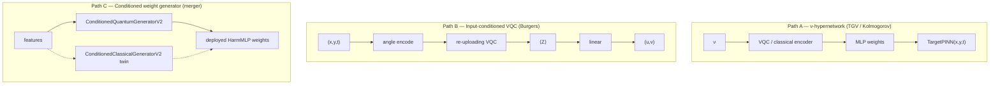
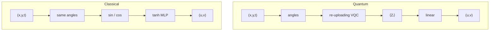

# Evaluating Variational Quantum Circuits in Physics-Informed Neural Networks for 2D Navier–Stokes

A systematic evaluation of variational quantum circuits (VQCs) inside physics-informed neural networks (PINNs) for 2D incompressible Navier–Stokes. The work spans $\nu$-conditioned hypernetworks, input-conditioned VQC field maps, and quantum weight generators for vortex merger. Matched classical baselines, degeneracy guards, and fixed DNS holdouts show no robust quantum advantage on these tasks. The project product is a classical HarmMLP PINN that reconstructs four-vortex merger against spectral DNS to **1.29%** FD-curl $\omega$ relative $L^2$, with a smaller distilled deployable net at **1.78%** $\omega$ and about $2.5\times$ inference throughput.

## 1. Introduction

Physics-informed neural networks enforce PDE residuals, boundary conditions, and data constraints through automatic differentiation. Pairing PINNs with variational quantum circuits is a recurring proposal for scientific machine learning: either the circuit generates network weights from a physical parameter (hypernetwork), or it evaluates the field map $f(x,y,t)$ directly. In simulation both paths are expensive. PennyLane `default.qubit` runs on CPU; PINN training requires second-order autodiff through the circuit; wall-clock cost is routinely $100$–$800\times$ a matched classical MLP at equal collocation size.

The scientific claim is not that a circuit can be wired into a loss. The claim is that, under fair capacity and protocol matching, the quantum model improves a primary metric without collapsing to a trivial solution.

Several evaluation failure modes invalidate quantum-PINN comparisons if left unchecked:

1. **Trivial solutions.** Soft initial-condition penalties can admit $u = v = 0$ when that field has small PDE residual.
2. **Unequal architectures.** Comparing a tiny deployed MLP labeled “quantum” to a much larger classical teacher confuses model size with quantum compute.
3. **Unused circuits.** Fixed circuit inputs, zeroed projection weights, or unused generators look like quantum training while computing classically.
4. **Proxy metrics.** PDE residual alone, or velocity MSE without vorticity structure, can look strong while the flow topology is wrong.

This project treats those constraints as first-class: matched parameters (or classical capacity at least that of quantum), fixed holdouts, soft versus hard initial conditions made explicit, and degeneracy diagnostics (`collapse_ratio`, `correction_rms`, circuit ablation).

The applied goal is a reproducible 2D Navier–Stokes PINN for **vortex merger** against spectral DNS, with FD-curl vorticity error at most $2\%$. The research goal is to test whether VQC hypernetworks or generators beat matched classical models on Taylor–Green (TGV), Kolmogorov forcing, Burgers, and merger. Evidence cutoff: 2026-08-26. All quantum results are simulator-only; no hardware.

## 2. Fairness Protocol and Metrics

1. **Capacity.** Trainable parameter counts matched, or classical at least as large as quantum.
2. **Protocol.** Same domain, viscosity $\nu$, collocation and initial-condition sampling, and (when soft IC is used) the same penalty weights.
3. **Features.** Where the VQC sees angle encodings, the classical control receives the corresponding sine and cosine features.
4. **Holdouts.** Fixed grids or held-out $\nu$ values — not a fresh i.i.d. draw of the training range labeled as generalization.
5. **Wall time.** Report simulator wall clock, not only optimizer step count.

| Problem | Primary metric | Secondary |
|---------|----------------|-----------|
| Taylor–Green (exact) | Velocity / gauge-aware pressure relative $L^2$; in-range vs extrapolated $\nu$ | Wall time |
| Kolmogorov (forced NS) | Holdout PDE residual RMS | Extrapolation in $\nu$ |
| Burgers VQC | Holdout PDE RMS under hard IC | `collapse_ratio`, `correction_rms` |
| Vortex merger | FD-curl $\omega$ relative $L^2$ max at $t \in \{0,2,5,8,12,15\}$, FP32 | Velocity relative $L^2$; inference points/s |

| Diagnostic | Meaning | Fail if |
|------------|---------|---------|
| $\mathrm{collapse\_ratio} = \mathrm{field\_rms}(t{=}1)/\mathrm{IC\_rms}$ | Near-zero field | $< 0.1$ |
| $\mathrm{correction\_rms}$ under hard IC $u = u_{\mathrm{IC}} + t\,N$ | Learned time evolution | $\ll 0.01 \times \mathrm{IC\_rms}$ (freeze) |
| Soft IC boundary loss $\approx 0.5$ | Matches the $u=v=0$ predictor | Plateau near $0.5$ with falling PDE loss |
| Circuit ablation | Randomize circuit weights / zero features | $\omega$ does not degrade $\Rightarrow$ circuit unused |

**Success criteria.** Quantum win: primary metric at most $90\%$ of classical *and* non-degenerate. Parity: within about $10\%$. Otherwise classical wins or the result is inconclusive. Soft-IC PDE RMS alone is never promoted.

## 3. System Architecture

Deployed solvers are classical MLPs evaluated at query time $(x,y,t)\mapsto(u,v,p)$:

- **DirectNSMLP** — Fourier / polynomial time features for TGV demos.
- **HarmMLP / TargetPINNNS** — harmonic Fourier features in $x,y$ with time channels, used for merger (product: width $96$–$96$, $k\le 6$; distilled student: $48$–$48$, $k\le 3$).

Training combines DNS collocation (merger), PDE residual, and optional hard IC of the form

$$
u = u_{\mathrm{IC}} + t\, N.
$$

Three quantum integration patterns were tested:

*Figure 1: Three quantum integration patterns. Only Path B evaluates the circuit on field coordinates. Paths A and C use the circuit (when live) as a weight generator; inference remains a classical MLP.*

A hypernetwork that never sees $(x,y,t)$ cannot claim circuit-in-the-loop PDE evaluation. Path C remains a fair test of whether a quantum generator beats a matched classical generator at **equal deployed latency**.

For vortex merger, the DNS reference is a periodic box $[0,2\pi]^2$, $\nu = 0.005$, four co-rotating Gaussian vortices merging toward a single core by $t \sim 15$. Gate times $t \in \{0,2,5,8,12,15\}$. Metric: finite-difference curl

$$
\omega = \partial_x v - \partial_y u,
$$

FP32 only, with maximum relative $L^2$ at most $2\%$.

*Figure 2: Co-rotating vortex merger — DNS | classical HarmMLP | quantum-trained deployable net. Pointwise FD-curl $\omega$ relative $L^2$ is $\le 2\%$, yet the red $+$ vortex centers co-rotate only in DNS: classical and quantum largely freeze angularly after early time. The networks fit vorticity amplitude well under a pointwise $L^2$ loss, but that loss does not penalize orbital phase, and plain time features do not encode a sustained co-rotating trajectory.*

## 4. Soft Initial Conditions and Degeneracy

On 2D Burgers, $u = v = 0$ solves the PDE with zero residual. Soft initial-condition penalties with moderate weight therefore create a basin of “be zero.” Soft-IC scouts showed a lower quantum PDE RMS while both models sat at a boundary loss consistent with predicting the zero field; the quantum run collapsed harder. The protocol therefore uses a hard initial condition

$$
\begin{aligned}
u &= u_{\mathrm{IC}}(x,y) + t\, N_u, \\
v &= v_{\mathrm{IC}}(x,y) + t\, N_v, \\
u_{\mathrm{IC}} &= \sin(\pi x)\cos(\pi y), \\
v_{\mathrm{IC}} &= -\cos(\pi x)\sin(\pi y).
\end{aligned}
$$

Under hard IC, classical learns viscous and advective evolution while the small input-conditioned VQC freezes near the initial condition. Constant-input weight generators are likewise excluded: a circuit that never sees a varying parameter emits one weight vector forever and is not a functional quantum map over tasks.

## 5. Hypernetworks and Burgers VQC

Direct classical PINNs establish that the PDE is learnable: TGV about $2.7\%$ mean velocity relative $L^2$ at $t=1$; harder regime $\nu=0.1$, $T=5$ about $4\%$ at $t=5$; Kolmogorov direct PDE RMS $0.00246$. Quantum models must beat a working classical baseline, not a collapsed field.

**TGV parametric hypernetworks** ($\nu \mapsto$ weights): classical wins on in-range and extrapolated $\nu$ (Appendix A). A redesigned expectation readout with log-$\nu$ encoding reduced quantum extrapolation chaos but did not produce a win.

**Kolmogorov forced NS:** same null on a harder PDE with sustained nonlinearity (Appendix A). The hypernetwork VQC line is closed for these tasks.

**Input-conditioned Burgers VQC** at matched capacity (about $92$ quantum versus $98$ classical parameters):

Under hard IC, classical learns evolution (`correction_rms` rises) while quantum freezes near the frozen-IC residual floor (Appendix B). The full multi-day preset was not run: the failure mode is expressivity / basin geometry, not undertraining. Simulator cost: about $7$ s/step at $512$ points for quantum versus milliseconds for classical on GPU.

Structural reading:

1. Mapping $\nu$ to roughly $1500$ weights is a classical-friendly encoder problem; the circuit never sees the field.
2. TGV families are nearly linear diffusion (advection and pressure cancel) — a weak stress test for entanglement.
3. A linear head on $\langle Z \rangle$ plus a small re-uploading circuit behaves like low-order trigonometric features; Burgers advection needs a second harmonic that the matched MLP can form and the VQC did not under this scout.
4. Matched parameter count does not imply matched useful function class under quantum constraints.

## 6. Vortex Merger Product

This section is the shipped solver: reconstruct four same-sign vortex merger against spectral DNS.

| Approach | Outcome |
|----------|---------|
| Pointwise $(u,v)$+curl, streamfunction, wide random Fourier features | Did not hit $2\%$ $\omega$ |
| HarmMLP $96$–$96$, $k\le 6$ | **1.29%** classical teacher |
| Distill HarmMLP $48$–$48$, $k\le 3$ | **1.75%** classical / **1.78%** inject |
| End-to-end QNN vs matched classical generator | No robust advantage |
| Multi-$\nu$ family generators | Both arms $\sim 33\%+$ $\omega$ |
| Orbit-gated relative $L^2$ + peak co-rotation | Partial; not promoted |

Harmonic Fourier features plus an FP32 curl gate on fixed DNS times were decisive. Distillation into a smaller HarmMLP preserves the $\le 2\%$ band at higher throughput.

| | Classical teacher | Deployable inject |
|--|-------------------|-------------------|
| Deployed net | HarmMLP $96$–$96$, $k\le 6$ | HarmMLP $48$–$48$, $k\le 3$ |
| Params | $13\,347$ | $3\,795$ |
| $\omega$ relative $L^2$ max | **1.29%** | **1.78%** |
| Velocity relative $L^2$ max | 3.75% | 2.95% |
| Inference ($256^2$) | $\sim 326$ Mpts/s | $\sim 829$ Mpts/s (**$\sim 2.5\times$**) |
| Circuit at train / infer | n/a | Unused (projection weight zeroed; student copied into bias) |

A classical distill of the same $48$–$48$ network hits **1.75%** $\omega$. The faster product checkpoint is therefore architecture size, not quantum computation.

*Figure 3: $\omega$ snapshots (red $+$ = vortex relative maxima) across gate times for DNS, classical teacher, and deployable student.*

**Fair end-to-end advantage.** Train a quantum weight generator end-to-end against a matched classical generator; both emit weights for the same HarmMLP $48$–$48$, $k\le 3$. Circuit ablation must degrade $\omega$ on quantum runs. Across six seeds, classical wins $4/6$; mean $\omega$ favors classical by about $0.10$ percentage points (Appendix C). **Verdict: no robust quantum advantage** at matched deployed latency.

**Multi-$\nu$ family.** Both quantum and classical generators plateau around $33$–$50\%$ training mean $\omega$ — not solvers. No advantage claim. This is an inconclusive attempt for both arms.

**Orbit / swirl fidelity.** Pointwise relative $L^2$ can pass while vorticity maxima freeze (DNS peaks continue to co-rotate). Adding orbital Fourier features $\sin(\Omega t)$ and $\cos(\Omega t)$ with $\Omega \approx -1.22$ improved early motion. Full-horizon swirl at most $5\%$ together with relative $L^2$ at most $2\%$ was not achieved in one promoted checkpoint (best compromise about $1.9\%$ relative $L^2$ / $7\%$ swirl). Product weights remain the pre-orbit inject pair.

## 7. Taylor–Green Vortex Visualizations

Stable 2D Taylor–Green is a weak physics stress test: $(u\cdot\nabla)u$ is absorbed into pressure, so the pattern only decays. It remains useful for visual comparison with an exact solution.

*Figure 4: Dense Taylor–Green Vortex $|\omega|$ (wavenumber $k=2$).*

*Figure 5: Exact | classical | quantum-trained Taylor–Green Vortex ($k=1$; velocity relative $L^2$ about $0.61\%$ / $0.62\%$). Animation horizon matches training, $t\in[0,5]$.*

Amplifying one lobe breaks exact balance and turns nonlinear advection back on ($\nu=0.03$, $T=12$).

*Figure 6: Unstable Taylor–Green Vortex — DNS | classical | quantum. Marker: boosted lobe center. Classical and quantum trained from scratch on this DNS (soft IC).*

## 8. Empirical Findings

1. **Classical PINNs solve the merger gate.** HarmMLP $96$–$96$ reaches **1.29%** FD-curl $\omega$ versus DNS; distilled $48$–$48$ stays inside $2\%$ at about $2.5\times$ inference throughput.
2. **$\nu$-hypernetwork VQCs lose** on TGV and Kolmogorov: matched classical generators are more accurate and about $1.8$–$2\times$ faster to train in wall clock.
3. Soft IC can produce misleading quantum rankings; under hard IC the Burgers VQC freezes near the initial condition.
4. Fair end-to-end quantum generators do not beat matched classical generators on single-$\nu$ merger (quantum wins $2/6$ seeds; mean favors classical by about $0.10$ pp).
5. The faster product “quantum” checkpoint does not use the circuit; a classical distill of the same small net matches its accuracy.
6. Pointwise $\omega$ is not swirl fidelity: orbit features help; a joint relative-$L^2$ and swirl product checkpoint was not shipped.
7. Simulator cost dominates for input-conditioned VQC PINNs at scout scale.

## 9. Conclusion

The contribution is a careful negative result on variational quantum circuits inside PINNs for 2D Navier–Stokes, paired with a positive classical PDE product. Under matched capacity, fixed holdouts, and degeneracy checks, VQC hypernetworks and input-conditioned circuits do not beat classical baselines on TGV, Kolmogorov, or Burgers. End-to-end quantum weight generators for vortex merger likewise show no robust advantage at equal deployed latency.

What does work is a harmonic-feature PINN against spectral DNS: **1.29%** $\omega$ on the classical teacher, **1.78%** on a smaller deployable net with about $2.5\times$ query throughput. That speedup is model size, not quantum compute. Methodologically, hard initial conditions, ablation tests, and architecture-matched controls are required before a quantum-PINN claim is credible.

## 10. References

[1] M. Raissi, P. Perdikaris, and G. E. Karniadakis (2019). *Physics-informed neural networks: A deep learning framework for solving forward and inverse problems involving nonlinear partial differential equations*. Journal of Computational Physics, 378, 686–707.

[2] G. E. Karniadakis, I. G. Kevrekidis, L. Lu, P. Perdikaris, S. Wang, and L. Yang (2021). *Physics-informed machine learning*. Nature Reviews Physics, 3, 422–440.

[3] V. Bergholm et al. (2018). *PennyLane: Automatic differentiation of hybrid quantum-classical computations*. arXiv:1811.04968. [https://arxiv.org/abs/1811.04968](https://arxiv.org/abs/1811.04968)

[4] M. Schuld, A. Bocharov, K. M. Svore, and N. Wiebe (2020). *Circuit-centric quantum classifiers*. Physical Review A, 101, 032308.

[5] A. Pérez-Salinas, A. Cervera-Lierta, E. Gil-Fuster, and J. I. Latorre (2020). *Data re-uploading for a universal quantum classifier*. Quantum, 4, 226.

[6] G. I. Taylor and A. E. Green (1937). *Mechanism of the production of small eddies from large ones*. Proceedings of the Royal Society A, 158, 499–521.

## 11. Appendix

### Appendix A: Hypernetwork Scoreboards

**TGV parametric ($\nu \mapsto$ weights)**

| Split | Classical | Quantum | Q/C |
|-------|-----------|---------|-----|
| in-range | **1.33%** | 1.72% | 1.29 |
| extrap-lo | **2.09%** | 49.0% | **23.4** |
| Wall time | 1182 s | 2146 s | 1.82$\times$ |

**Kolmogorov forced NS**

| Split | Classical | Quantum | Q/C |
|-------|-----------|---------|-----|
| in-range PDE RMS | **0.00288** | 0.00534 | 1.85 |
| Combined extrap | — | — | **1.50** |
| Wall time | 1145 s | 2119 s | 1.85$\times$ |

### Appendix B: Burgers Hard-IC Scout

Hard-IC scout (400 steps, 512 collocation points):

| Metric | Classical | Quantum | Frozen IC ($N=0$) |
|--------|-----------|---------|---------------------|
| Holdout PDE RMS | **0.799** | 1.631 | **1.563** |
| `collapse_ratio` | 0.67 | 0.996 | 1.0 |
| `correction_rms` | 0.57 | **0.024** | 0 |
| Wall time | 4 s | 732 s | — |

### Appendix C: Fair Merger Generator Matchup

Primary matchup ($q=8$, $L=4$, bottleneck $64$; seeds $0$–$5$):

| | Quantum generator | Classical generator |
|--|-------------------|---------------------|
| Mean $\omega$ $\pm$ pstdev | $2.325\% \pm 0.38\%$ | **$2.220\% \pm 0.24\%$** |
| Seed wins | $2/6$ | **$4/6$** |
| Best seed | $1.895\%$ | $1.987\%$ (long classical best $1.823\%$) |

Mean difference $+0.10$ percentage points against quantum. Other sweeps agree or favor classical.
